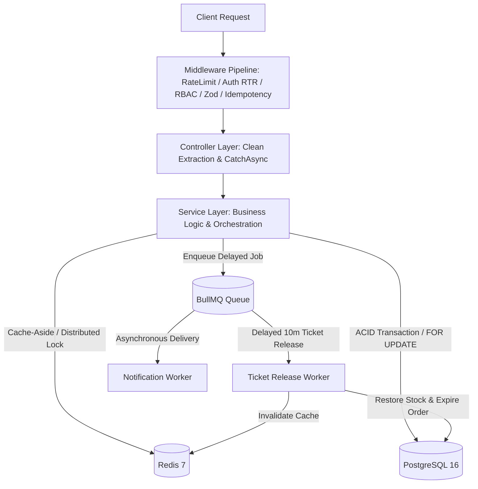

# High-Concurrency Event Ticketing & Flash-Sale Engine

A production-grade backend engine designed to handle high-traffic flash-sale ticketing events with zero overselling, multi-layer caching, distributed idempotency, and automated delayed-job stock recovery.

**Tech Stack**: Node.js (ES Modules), Express 5, PostgreSQL 16, Redis 7, Prisma ORM 6, BullMQ, Zod, Docker.

---

## 1. KEY METRICS & PROOF OF WORK

| Metric                             | Direct Database | Redis Cache-Aside         | Result / Impact                      |
| :-----------------------------------| :---------------:| :-------------------------:| :-------------------------------------|
| **Read Throughput**                | 903 RPS         | **3,303 RPS**             | **~3.7x higher throughput**          |
| **Read Latency (Average)**         | 54.76 ms        | **14.67 ms**              | **-73.2% latency reduction**         |
| **Read Latency (p99)**             | 129.00 ms       | **29.00 ms**              | Sub-30ms at 99th percentile          |
| **Write Concurrency (Flash-Sale)** | -               | **250 concurrent buyers** | **0% overselling (ACID guaranteed)** |
| **Write Resolution Time**          | -               | **1,139 ms total batch**  | 219 req/sec under row lock           |

*Full benchmark logs, methodology, and Autocannon outputs are available in [docs/BENCHMARK.md](docs/BENCHMARK.md).*

---

## 2. ARCHITECTURE & SYSTEM DESIGN

The system follows a strict **3-Layer Architecture** with decoupled background job processing.



---

## 3. CORE TECHNICAL SOLUTIONS

| Problem | Root Cause | Implemented Solution | Trade-off / Rationale |
| :--- | :--- | :--- | :--- |
| **Race Condition & Overselling** | Concurrent writes on `available_stock` during flash sales. | **PostgreSQL Pessimistic Locking** (`SELECT ... FOR UPDATE`) within a database transaction. | Guarantees 100% ACID consistency. Serializes writes on the locked row, preventing overselling. |
| **Double-Payment (Non-Idempotent Checkout)** | Network retries or rapid double-clicks from clients. | **Distributed Idempotency Layer** (`X-Idempotency-Key`): Redis atomic lock (`SET NX EX 120`), cached 24h response, and DB `@unique` constraint. | Redis intercepts concurrent duplicates in $< 2\text{ms}$; DB unique index acts as the permanent safety net. |
| **Expired Hold Resource Leaks** | Users hold tickets during checkout but abandon payment. | **BullMQ Delayed Queue** using Redis Sorted Sets (`ZSET`). | Eliminates periodic full-table database cron polling. Automatically restores stock precisely at $T + 10\text{m}$. |
| **Cache Stampede (Thundering Herd)** | High-traffic event cache key expires, causing concurrent DB stampedes. | **Redis Mutex Locking** (`SET lock:event:id 1 NX EX 5`). | Only 1 worker queries DB on cache-miss; concurrent requests wait or read cached fallback. |
| **Cache Penetration** | Malicious queries with non-existent IDs hitting the database directly. | **Sentinel Null Caching** (`__NULL__` with 60s TTL). | Immediate 404 response directly from Redis memory without touching PostgreSQL. |
| **Refresh Token Theft (RTR)** | Stolen refresh tokens reused across multiple devices. | **Refresh Token Rotation (RTR)** with **Reuse Detection**. | Old tokens marked `isRevoked: true`. Replay of revoked tokens immediately terminates all user sessions. |

---

## 4. API SPECIFICATION

All endpoints follow RESTful standards with standardized JSON envelopes (`ApiResponse`).

### Authentication (`/api/v1/auth`)
* `POST /register`: Register a new user account (Password hashed via `bcrypt`).
* `POST /login`: Authenticate and receive Access Token (JWT) and Refresh Token (SHA-256 hashed in DB).
* `POST /refresh`: Rotate tokens with reuse detection honeypot.
* `POST /logout`: Invalidate current session refresh token.
* `POST /logout-all`: Invalidate all active user sessions across all devices.

### Events & Catalog (`/api/v1/events`)
* `GET /`: Get paginated event list (Cache-Aside, TTL: 60s).
* `GET /:id`: Get event details and ticket tiers (Cache-Aside with Anti-Stampede & Anti-Penetration).
* `POST /`: Create a new event (ORGANIZER, ADMIN only).
* `POST /:id/tiers`: Create a ticket tier for an event.

### Flash-Sale Ticketing & Checkout (`/api/v1`)
* `POST /tickets/hold`: Atomically hold tickets with row-level pessimistic locking (`SELECT ... FOR UPDATE`).
* `POST /orders/:id/checkout`: Idempotent checkout requiring `X-Idempotency-Key` header.

*Postman Collection with pre-configured environments is available at [docs/postman_collection.json](docs/postman_collection.json).*

---

## 5. QUICKSTART & LOCAL SETUP

### Prerequisites
* Node.js v20+
* Docker & Docker Compose

### 1. Start Infrastructure Containers
```bash
docker compose up -d
```
* PostgreSQL available on `localhost:5433`
* Redis available on `localhost:6379`

### 2. Install Dependencies & Migrate Schema
```bash
npm install
npx prisma db push
```

### 3. Run Development Server
```bash
npm run dev
```
Server runs on `http://localhost:5001`.

---

## 6. VERIFICATION & BENCHMARK SUITE

Every component is covered by automated verification scripts:

```bash
# Infrastructure & Database connectivity
npm run test:infra

# Authentication, RTR, and Session revocation
npm run test:auth

# Redis Cache-Aside, Invalidation, and Penetration defense
npm run test:cache

# Concurrency & Overselling test (100 concurrent requests)
npm run test:concurrency

# BullMQ delayed release worker & timeout stock recovery
npm run test:queue

# Idempotency, replay attack defense, and order completion
npm run test:checkout

# Run full Autocannon stress testing & load benchmark
npm run test:benchmark
```

---

## 7. SCALABILITY ROADMAP (NEXT-GEN FLASH-SALE)

For scaling beyond 10,000+ concurrent writes per second:
1. **Redis Atomic Decrement (Lua Script)**: Move inventory decrement into Redis memory using atomic Lua scripts, rejecting 90%+ of losing requests in $< 1\text{ms}$ before touching PostgreSQL.
2. **PgBouncer Connection Pooling**: Deploy PgBouncer in `Transaction Pooling` mode to multiplex 10,000+ client connections over 50 physical database sockets.
3. **Asynchronous Order Ingestion**: Push winning reservations to Kafka/BullMQ for batch insertion into PostgreSQL, smoothing database write spikes.